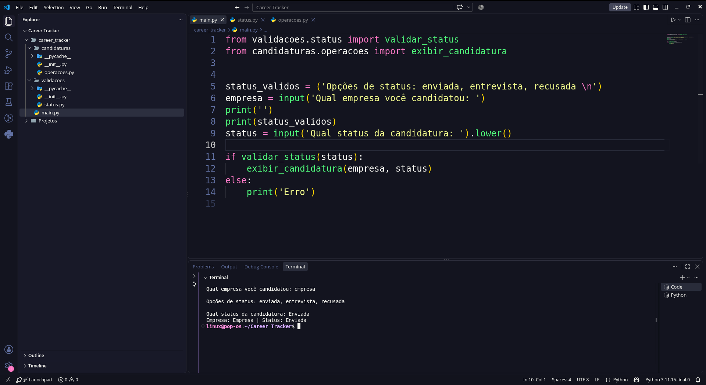

# Career Tracker — protótipo

Primeiro esboço de um programa em Python para acompanhar candidaturas a vagas. Esta versão recebe o nome de uma empresa e a situação da candidatura, valida a situação informada e exibe os dados no terminal.

> Estado do projeto: `v0.0.1-prototype`. O código original foi mantido sem alterações para registrar a evolução do aprendizado.

## O que funciona nesta versão

- Solicita o nome da empresa.
- Aceita as situações `enviada`, `entrevista` e `recusada`, sem distinguir maiúsculas de minúsculas.
- Exibe a empresa e a situação quando o status é válido; caso contrário, exibe `Erro`.
- Separa o programa principal das funções de validação e exibição em módulos Python.

## Como executar

É necessário ter Python 3 instalado. Na pasta do repositório:

```bash
cd career_tracker
python3 main.py
```

No Windows, o comando pode ser `python main.py`. Não há dependências externas nem configuração de banco de dados nesta versão.

Exemplo de uso:

```text
Qual empresa você candidatou: Empresa Exemplo

Opções de status: enviada, entrevista, recusada

Qual status da candidatura: Enviada
Empresa: Empresa exemplo | Status: Enviada
```



## Limitações conhecidas

- A candidatura é apenas exibida: nenhum histórico é salvo ou consultado depois que o programa termina.
- Não há verificação do nome da empresa; um nome vazio é aceito.
- O status é convertido para minúsculas, mas espaços extras não são removidos: ` enviada ` é rejeitado.
- O programa pede uma candidatura por execução e não permite atualização da situação de uma vaga.
- A exibição usa `capitalize()`, que altera as demais letras do nome para minúsculas.

Estas limitações foram preservadas de propósito nesta publicação inicial.

## Próximos passos planejados

- Ampliar o tratamento de erros e validar melhor os dados inseridos.
- Registrar e consultar várias candidaturas.
- Atualizar a situação das vagas.
- Persistir o histórico em PostgreSQL quando a aplicação estiver pronta para isso.

## Estrutura

```text
career_tracker/
├── main.py
├── candidaturas/
│   ├── __init__.py
│   └── operacoes.py
└── validacoes/
    ├── __init__.py
    └── status.py
```

Projeto de estudo em desenvolvimento. O objetivo é mostrar a primeira versão e acompanhar as melhorias ao longo do tempo.
